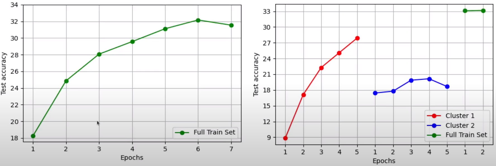
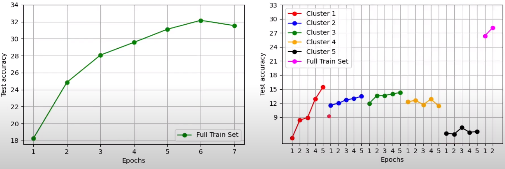

# curriculum-learning
Traditionally, neural networks are trained on batches of randomly shuffled training data. However, in this project, we explore if there is any improvement to be found without changing anything w.r.t. the model architecture, but only changing the way data is presented to the model during training. This is often referred to as ***curriculum learning***. We propose two curricula to train a neural network on the image classification task (irrespective of the architecture). 

We call the two curricula: `Supervised Incremental Variation` and `Unsupervised Incremental Variation`. We experiment with two datasets: CIFAR and Oxford Flowers-102.

## Datasets
- CIFAR 100: Available [here](https://www.cs.toronto.edu/~kriz/cifar.html)
- Oxford Flowers-102: Available [here](https://www.robots.ox.ac.uk/~vgg/data/flowers/102/)

## Techniques
The unsupervised curriculum is based on the idea of gradually increasing the variation in the training data.Note that in developing this curriculum, we do not require the labels of the images being used for training.

The supervised curriculum is based on the idea of gradually increasing the variation in terms of the number of classes shown to the network. Since we are using the ground truth labels in this technique, we prefix it with "supervised".

### Baseline
We first train ResNet-18 from scratch (without any curriculum) on the two datasets. The code for this baseline can be found in [`baseline.ipynb`](baseline.ipynb).

### Curriculum 1: Unsupervised Incremental Difficulty
The notebook titled [`unsupervised_curriculum.ipynb`](unsupervised_curriculum.ipynb) has the code for this curriculum.

Here, we follow the following series of steps:
1. Extract features for the training images using a VGG16 (pretrained on ImageNet). 
2. Cluster these features using KMeans
3. Present the training images to the network (ResNet-18 here) cluster-by-cluster
4. Do residual training for a very few (2 in our experiments) epochs on the whole dataset.

For different number of clusters, we get the following results on the **CIFAR** dataset (Note that the data is presented to the model the same number of times irrespective of whether we are using a curriculum or not for a fair comparison):

#### Observations
* An interesting observation is that as we increase the number of clusters, even after some residual training on the entire dataset at the end, we get poorer performance (compared to the baseline).
* Given that we find a ***`good`*** number of clusters, this method can potentially lead to performance benefits as we see in the 2-cluster case.

### Curriculum 2: Supervised Incremental Difficulty
The notebook titled [`supervised_curriculum.ipynb`](supervised_curriculum.ipynb) has the implementation for this technique.

In this technique, we do the following:
1. Only present two classes to the network initally.
2. Gradually increase the number of classes presented to the network every `x` epochs.

